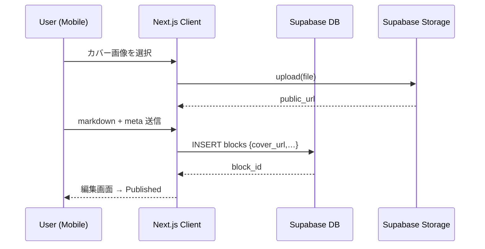
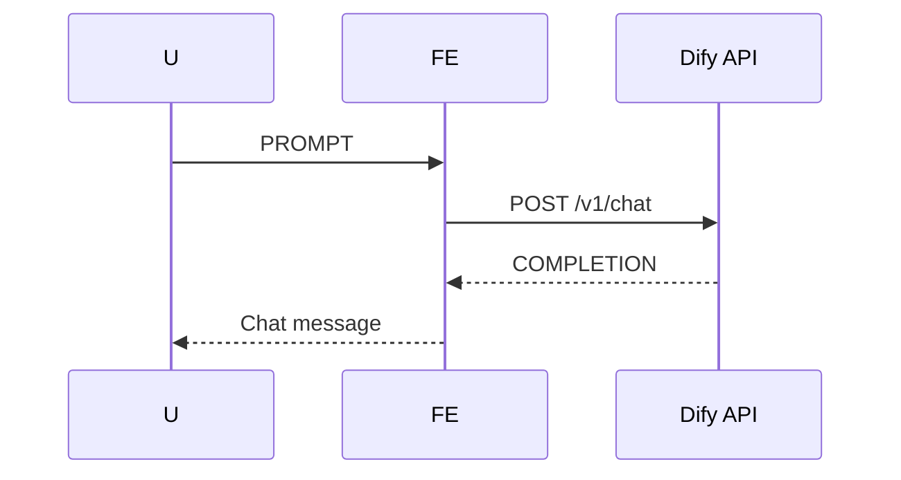

# 🏗️ architecture.md — 技術アーキテクチャ設計 (Wisdom‑Hub)

> **本書の目的**: `requirements.md` を実装へマッピングするために、システム全体を構成要素・データフロー・依存関係の観点で明文化する。Cursor での開発と Supabase MCP 運用時に迷わないための“技術仕様書”。

---

## 0. ハイレベル構成図

```mermaid
flowchart LR
  subgraph Client (PWA)
    A[Next.js<br>App Router<br>shadcn/ui]
    SW(Service Worker):::bg
  end
  subgraph Supabase
    SBAuth[Auth]
    SBDB[(Postgres DB<br>+ Row Level Security)]
    SBStorage[Storage]
    Edge[Edge Functions<br>(cron)]
  end
  Dify[Dify Cloud via REST]
  Vercel[Vercel Hosting]

  A -- Supabase JS SDK --> SBAuth & SBDB & SBStorage
  A -- fetch --> Dify
  Edge -- Supabase Client --> SBDB & SBAuth

  click Vercel "https://vercel.com" "open in browser"
  classDef bg fill:#0f3b25,color:#fff
```

---

## 1. リポジトリ構造 (推奨)

```
wisdom-hub/
├─ app/                 # Next.js App Router ディレクトリ
│  ├─ (auth)/           # 認証関連ページ
│  ├─ dashboard/        # ホーム / ナビ
│  ├─ workspace/[id]/   # ボックス / ブロック動的ルート
│  └─ api/edge/         # Edge Function 呼び出し
├─ components/
│  ├─ ui/               # shadcn/ui 拡張コンポーネント
│  ├─ blocks/           # ブロック一覧・カード
│  └─ chatbot/
├─ lib/
│  ├─ supabase.ts       # Supabase Client ラッパー
│  ├─ dify.ts           # Dify API ラッパー
│  └─ hooks/
├─ supabase/
│  ├─ migrations/       # schema.sql & RLS
│  └─ functions/        # Edge Functions (cron-mail.ts)
├─ public/
├─ styles/
└─ tests/
```

---

## 2. クライアント層

### 2.1 Next.js

| 要素                  | 採用理由                                      |
| --------------------- | --------------------------------------------- |
| **App Router**        | レイアウト共有が楽・PWA 設定が簡単            |
| **Server Components** | DB 読取系で使用し、データ取得をサーバ側へ     |
| **Client Components** | エディタ、AI チャットなどインタラクティブ部分 |
| **Metadata**          | PWA Manifest & OpenGraph 自動生成             |

### 2.2 状態管理

- **Zustand** を採用（シンプル & Server Actions と相性 ◎）
- User 信息 / ワークスペースコンテキスト / 下書きオートセーブに利用

### 2.3 リッチテキストエディタ

- [tiptap](https://tiptap.dev) + Markdown 拡張
- 画像ドラッグ & ドロップ → Supabase Storage へアップロード

### 2.4 チャットボット UI

- `ChatDrawer` コンポーネント (右下固定 FAB + Slide‑in 500 px 幅)
- API: `/api/edge/chat?prompt=...` → Next.js Route Handler → `lib/dify.ts`

### 2.5 Service Worker

- Workbox + Next‑PWA
- `staleWhileRevalidate` で既読ブロックと静的アセットを Cache

---

## 3. サーバ層

### 3.1 Supabase Postgres (スキーマ詳細 requirements 参照)

- **RLS**: 各 `user_id` 列に `auth.uid() = user_id` 条件
- **Policies**

  - `SELECT`, `INSERT`, `UPDATE`, `DELETE` それぞれ最小権限

### 3.2 Edge Functions

| Function              | Trigger                 | 処理                                                                           |
| --------------------- | ----------------------- | ------------------------------------------------------------------------------ |
| `cron-mail.ts`        | `cron(0 0 * * 1)` (UTC) | ・`progress_logs` から inactivity ユーザー抽出<br>・Mail API (Resend) 経由送信 |
| `webhook-progress.ts` | HTTP                    | ブロック既読イベントを受け取り `progress_logs` 更新                            |

### 3.3 Storage

- バケット `cover_images` / `editor_uploads`
- パブリックアクセス：`cover_images` のみ (アプリ内安全表示)

---

## 4. 外部サービス

| サービス             | 用途                            | KPI        |
| -------------------- | ------------------------------- | ---------- |
| **Dify Cloud**       | AI チャット / RAG               | 応答 < 2 s |
| **Resend**           | トランザクションメール          | 到達率 99% |
| **Vercel Analytics** | パフォーマンス & コアウェブ指標 | CLS < 0.1  |

---

## 5. データフロー (代表シーケンス)

### 5.1 ブロック作成



### 5.2 AI チャット



---

## 6. 環境変数 (.env.local)

| Key                             | 用途                      |
| ------------------------------- | ------------------------- |
| `NEXT_PUBLIC_SUPABASE_URL`      | Supabase プロジェクト URL |
| `NEXT_PUBLIC_SUPABASE_ANON_KEY` | Public anon key           |
| `SUPABASE_SERVICE_ROLE_KEY`     | Edge Functions 用 (秘密)  |
| `DIFY_API_KEY`                  | AI チャット呼び出し       |
| `RESEND_API_KEY`                | メール送信                |

---

## 7. デプロイ & CI/CD

1. GitHub → Vercel 連携 (Preview / Production)
2. `vercel.json` で Edge Functions を有効化
3. Supabase migrations → `supabase db push` (MCP) — PR マージ時に CI で走らせる
4. Playwright で E2E テスト → Vercel Preview Gate

---

## 8. セキュリティ & 可観測性

- **セキュリティ**: CSP ヘッダー, Helmet, SQL Injection 防止 (Supabase RPC 未使用)
- **監査ログ**: Supabase `logflare` 連携
- **エラー追跡**: Sentry (Next.js Plugin)

---

## 9. 将来拡張ポイント

- Realtime Presence (学習仲間がオンラインか表示)
- Plugin‑based エディタ拡張 (Mermaid, MathJax)
- GPT‑4o Mini on-device inference (オフライン AI 支援)
